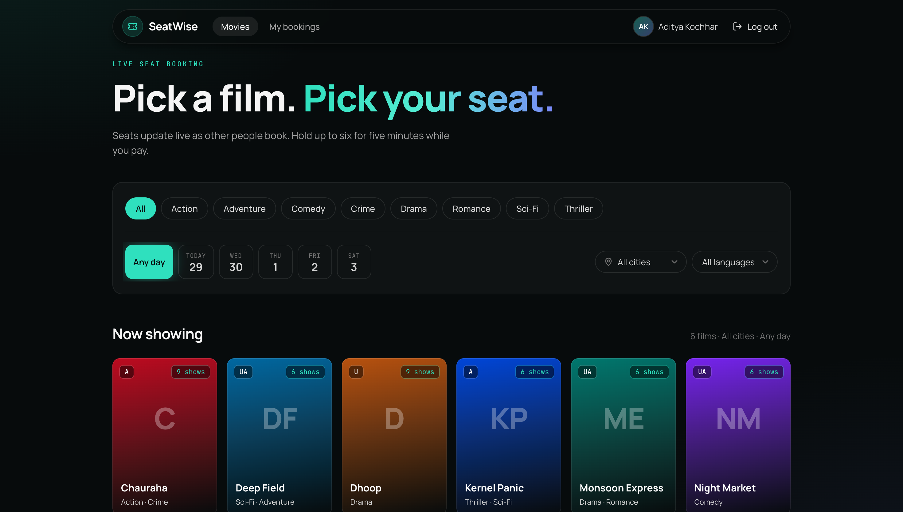
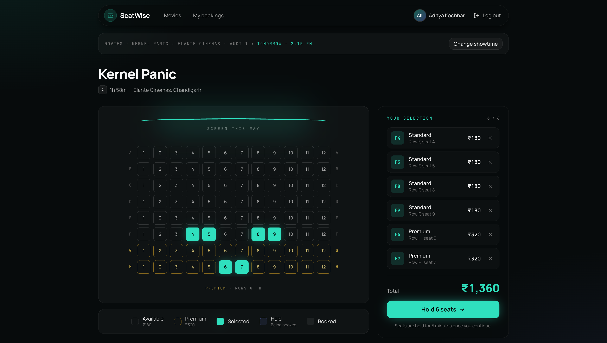
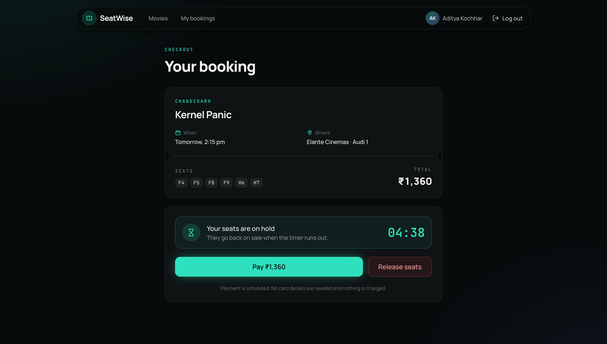
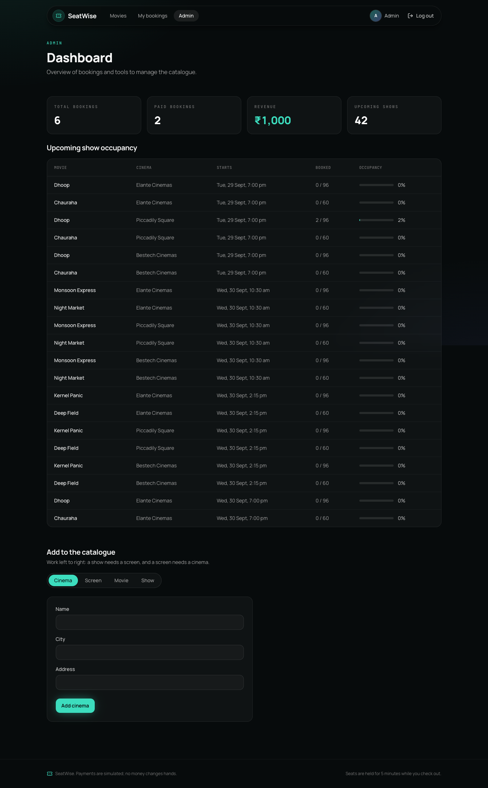

# SeatWise

A cinema seat booking app where seats update live for everyone looking at the same show.

## About

SeatWise lets you pick a city and a show, choose seats on a seat map, and hold them for five minutes while you pay. I built it to handle the one thing every booking site has to get right: two people clicking the same seat at the same moment. Only one of them gets it, and anyone else viewing that show sees the seat go grey straight away. Payment is simulated, so no real money is involved.

## Features

- Browse movies and filter by genre, language, city and date
- Showtimes grouped by cinema, with the number of seats left for each show
- Seat map with standard and premium rows, up to 6 seats per booking
- Seats are held for 5 minutes with a countdown at checkout; if time runs out they go back on sale
- Live seat updates over Socket.IO for holds, bookings, releases and expiries
- Simulated payment that gives you a ticket code
- My bookings page showing confirmed, pending, cancelled and expired bookings
- Sign up and log in with JWT, with a password strength meter on sign up
- Admin dashboard to add cinemas, screens, movies and shows, and see bookings, revenue and occupancy
- 19 API tests, including one that sends two requests for the same seat at once and checks that exactly one wins

## Tech Stack

- **Frontend:** React, TypeScript, Vite, Tailwind CSS, React Router, TanStack Query, Socket.IO client
- **Backend:** Node.js, Express, TypeScript, Mongoose, Socket.IO, Zod, JWT, bcryptjs
- **Database:** MongoDB (MongoDB Atlas for the live version)
- **Testing:** Jest, Supertest, mongodb-memory-server
- **Tools:** Docker Compose, GitHub Actions (typecheck, test and build on every push to `main`), Render for hosting

## Screenshots

**Home page with filters**



**Seat selection**



**Checkout with hold countdown**



**Admin dashboard**



## Live Demo

- App: https://seatwise-0njd.onrender.com
- API health check: https://seatwise-api-eqj2.onrender.com/api/health

It runs on Render's free plan, so the first load after a quiet period can take about a minute while the server wakes up.

Demo logins (also created locally by `npm run seed`):

| Role  | Email              | Password  |
|-------|--------------------|-----------|
| Admin | admin@seatwise.dev | Admin@123 |
| User  | demo@seatwise.dev  | Demo@123  |

To see the live updates, open the same show in two windows (one of them incognito) and hold seats in one of them.

## Getting Started

You need Node 18+ and a MongoDB database (a local install or a MongoDB Atlas connection string).

### 1. Clone the repository

```bash
git clone https://github.com/adityakochhar/SeatWise.git
cd SeatWise
```

### 2. Install dependencies

The frontend and backend are separate Node projects, so install both:

```bash
cd server && npm install
cd ../client && npm install
cd ..
```

### 3. Configure environment variables

```bash
cp server/.env.example server/.env
cp client/.env.example client/.env
```

Then edit `server/.env`:

| Variable | What it's for |
|---|---|
| `PORT` | API port (`4000`) |
| `MONGO_URI` | MongoDB connection string, e.g. `mongodb://127.0.0.1:27017/seatwise` |
| `JWT_SECRET` | any long random string, used to sign login tokens |
| `CLIENT_ORIGIN` | the frontend URL the API accepts requests from (`http://localhost:5173`) |
| `HOLD_MINUTES` | how long seats stay held (`5`) |

`client/.env` only has `VITE_API_URL`, which points to the API (`http://localhost:4000`).

Show times are read in the server's timezone, so run the server with `TZ=Asia/Kolkata` if your machine uses a different one.

### 4. Start the application

Load the demo data once, then start the API:

```bash
cd server
npm run seed
npm run dev
```

In a second terminal, start the frontend:

```bash
cd client
npm run dev
```

Open http://localhost:5173. The API runs on http://localhost:4000.

The seed script wipes the existing SeatWise data first, then adds 3 cinemas, 6 movies, shows for the next five days and the two demo accounts.

**With Docker** (instead of steps 2 to 4):

```bash
docker compose up --build
docker compose exec api node dist/scripts/seed.js
```

Then open http://localhost:8080.

**Running the tests:**

```bash
cd server
npm test
```

The tests use an in-memory MongoDB, so nothing else needs to be running.

## Project Structure

```
SeatWise/
├── client/                  React frontend
│   └── src/
│       ├── api/             fetch wrapper and one file per API area
│       ├── auth/            login state and protected routes
│       ├── components/      layout, ui, movies, seats and bookings components
│       ├── pages/           one file per page (admin/ has the dashboard and its forms)
│       ├── realtime/        Socket.IO client and live seat updates
│       ├── hooks/           useCountdown, useFormFields, useQueryParam
│       └── lib/             formatting, dates, validation and query keys
├── server/                  Express API
│   ├── src/
│   │   ├── modules/         auth, users, cinemas, movies, shows, bookings, admin, catalogue
│   │   ├── middleware/      auth, validation, error handling
│   │   ├── realtime/        Socket.IO setup
│   │   ├── jobs/            releases expired holds every 30 seconds
│   │   └── scripts/seed.ts  demo data
│   └── tests/               API tests
├── docker-compose.yml
└── .github/workflows/ci.yml
```

Backend modules are split by file type: `*.model.ts` (Mongoose schema), `*.schemas.ts` (Zod validation), `*.service.ts` (the logic) and `*.routes.ts` (Express routes).

## How It Works

1. You pick a movie and a showtime. The seat map loads, and the page joins a Socket.IO room for that show.
2. You select up to 6 seats and click Hold. The server claims each seat with a single conditional update that only succeeds if the seat is still available or its hold has expired. MongoDB applies writes to one document one at a time, so two requests for the same seat can't both win.
3. If some seats were taken first, the server returns `409 Conflict` with those seat labels and releases the seats it did get. Otherwise the seats are held for 5 minutes, and everyone viewing the show sees them change.
4. At checkout you get a countdown. Paying (simulated) confirms only the seats still held by your booking and gives you a ticket code. Releasing, or letting the timer run out, puts the seats back on sale.
5. A hold's expiry is stored as a timestamp, so an expired hold counts as free even if the server restarts. A background job also cleans up expired holds every 30 seconds.

The seat-claiming logic is in `server/src/modules/bookings/booking.service.ts`, and the two-requests-one-seat test is in `server/tests/bookings.test.ts`.

## API Endpoints

All routes are under `/api`. Errors come back as `{ "message": "...", "details": ... }`.

| Method | Route | Auth | Purpose |
|---|---|---|---|
| GET | /health | – | health check |
| POST | /auth/register | – | create an account |
| POST | /auth/login | – | log in and get a JWT |
| GET | /auth/me | user | current user |
| GET | /cities | – | cities that have cinemas |
| GET | /movies, /movies/:id | – | movie catalogue |
| GET | /shows?movieId&city&date | – | shows with available seat counts |
| GET | /shows/:id | – | one show |
| GET | /shows/:id/seats | – | seat map for a show |
| POST | /bookings/hold | user | hold up to 6 seats |
| POST | /bookings/:id/confirm | user | simulated payment |
| POST | /bookings/:id/cancel | user | release a held booking |
| GET | /bookings/me | user | my bookings |
| GET | /bookings/:id | user | one booking |
| GET, POST | /admin/cinemas | admin | list or add cinemas |
| GET, POST | /admin/screens | admin | list a cinema's screens or add one |
| POST | /admin/movies | admin | add a movie |
| POST | /admin/shows | admin | add a show (this also creates its seats) |
| GET | /admin/stats | admin | bookings, revenue and occupancy |

Socket.IO events: the client sends `show:join` / `show:leave` with a show id, and the server sends `seats:changed` with `{ showId, seats: [{ id, status }] }`.
